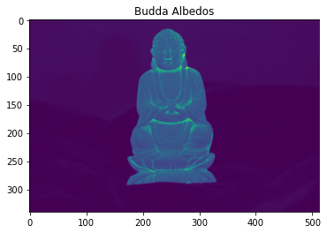
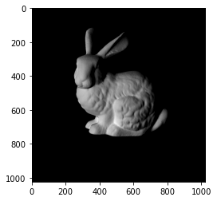
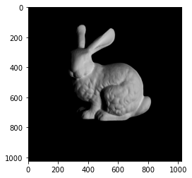

# Photometric Stereo and Structure from Motion
This repository is a part of my coursework toward the course `CS 682` **Computer Vision** at *George Mason University (GMU)*.

The task focuses the following sections:
1. Lighting a Scene
2. Photometric Stereo
    * Using provided data
    * Imperfections in Photometric Stereo
    * Lambertian Objects in Blender
    * Non-Lambertian Objects in Blender
3. Structure from Motion
    * Implementation
    * Followup Questions

## Libraries
* `numpy`
* `matplotlib`
* `scipy`
* `cv2`
* `PIL`
* `skimage`
* `ipywidgets`

## Results
Albedos of Buddha idol

Lighting the Stanford Bunny from different view points.

